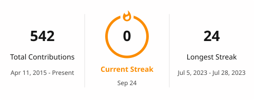

# 👋 Hi, I'm Onefiter

Backend developer focused on building reliable and maintainable systems.

I mainly work with **Go** and **PHP**, and I'm also interested in
Node.js, databases, infrastructure and developer tooling.

---

## 📊 GitHub Stats

  
  

  

---

## 🛠️ Tech Stack

**Backend**

Go · PHP · Node.js

**Database**

MySQL · Redis

**Infrastructure**

Linux · Docker · Nginx

**Tools**

Git · GitHub Actions · VS Code

---

## 🚀 What I Do

- Backend service development
- API design and performance optimization
- Database design and optimization
- Distributed system development
- Developer tooling and automation

---

## 📌 Currently

- Building backend services with **Go**
- Working with **PHP** based systems
- Exploring **Node.js** and modern frontend tooling
- Improving development workflows and engineering efficiency

---

  <i>Keep building. Keep learning.</i>

